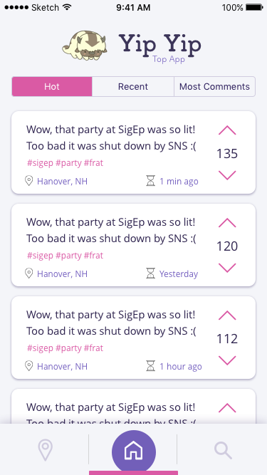
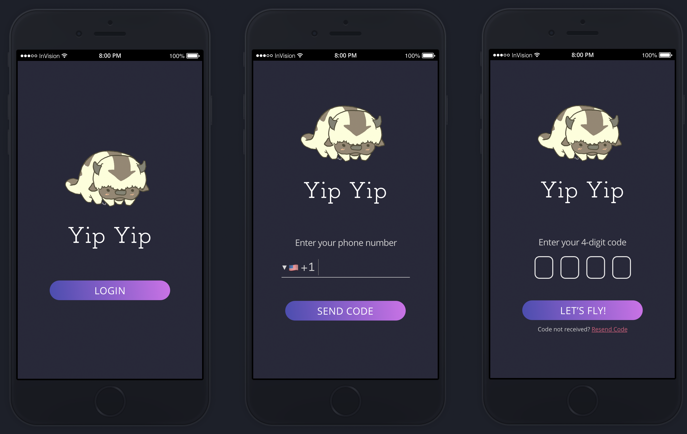
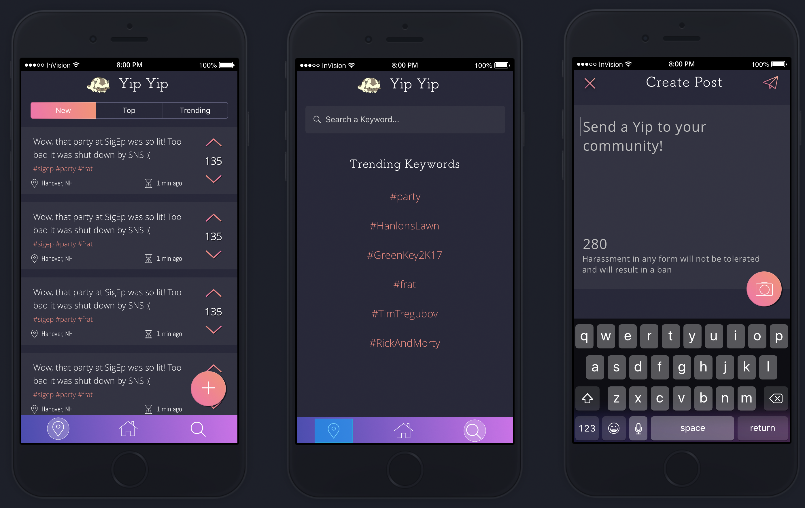
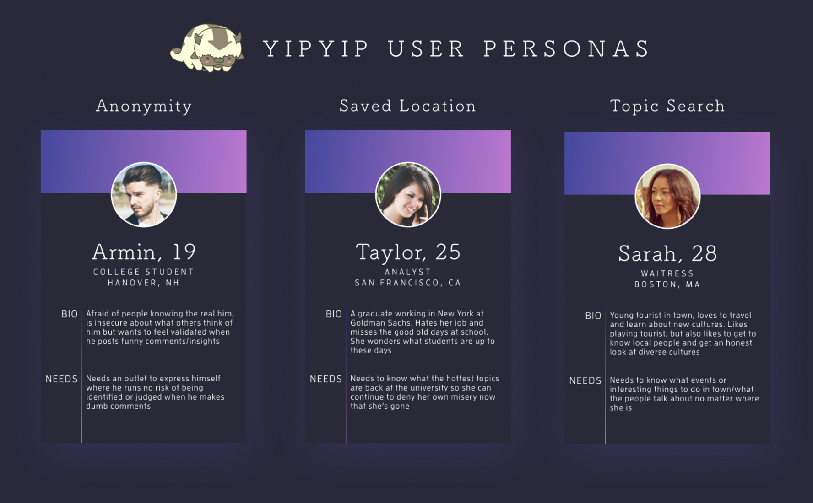

# Yip Yip (Top App)

**Yip Yip** is a real-time, localized, anonymous feed for short comments, jokes, images, and discussion..



We once had gradients...







## Architecture

TODO:  descriptions of code organization and tools and libraries used

Styling on app:
Also, I think the standard for styles on React Native is inline (`const styles = StyleSheet.create({ everyStyleIsAnObject })`) and we `import { StyleSheet } from ‘react-native’;` In general, `docs/ARCHITECTURE.md` is very helpful for understanding the project’s setup and some of the differences between React and React Native.

Authentication:
The starter pack I think is best once used Auth0 instead of Passport ([comparison here](https://auth0.com/learn/lp-auth0-vs-passport/)) and there are [instructions here](https://github.com/futurice/pepperoni-app-kit/blob/master/docs/AUTH0.md) if we want to bring that back.

## Setup

First, follow the [React Native getting started page instructions](https://facebook.github.io/react-native/docs/getting-started.html) to install all the required dependencies.

```
git clone https://github.com/dartmouth-cs52-17S/yip-yip-top-app.git
cd yip-yip-top-app
yarn install
react-native run-ios
```

If you want to run the simulator on a specific iPhone model you can run a similar command: `react-native run-ios --simulator="iPhone 7 Plus"`

Reloading:

Once the iOS simulator is running, you can open the developer tools menu by pressing `cmd+ctrl+Z` or going to `Hardware > Shake Gesture`. From this screen, you can enable hot reloading. You can also just reload the simulator with `cmd+r`.

## Deployment

We can use CodePush to deploy our app.
  $ npm install -g code-push-cli
  After creating a CodePush account, you can simply use the following command via the CLI and authenticate with either your GitHub or Microsoft account:
  $ code-push register
  $ code-push app add Yip Yip
  Add the appropriate CodePush client SDKs to your app, and configure them to query for updates against the app deployment created above.
  For the react-native platform, follow https://github.com/Microsoft/react-native-code-push#getting-started
  For updates, run the release-react comand in the CodePush CLI, which will handle bundling your JavaScript and asset files and releasing the update to the CodePush server. For example: code-push release-react MyApp ios.

## Authors

Armin Mahban, Byrne Hollander, Ellis Guo, Jenny Seong, Ying Liu

## Acknowledgments

Tim and Irene, probably

## Feature Spec

### Front End Features

#### Realtime feed

- Based on location, includes all posts from within a certain radius
- Can join in channels/communities to narrow down your feed

#### Posts

- Approx. 280 chars
- Potentially include titles, tags, images
- Can be voted on
- Can be commented on, comments also have votes

#### Other Front End details

- All posts, comments, and votes are anonymous, no identifying information or ability to link a user to another comment or post
- Potential: Incorporate AI-based content moderation
- Every user can have “karma” points/scores as a way of seeing how much they use the app and how much people like their content, but will not be shared with others
- Can set a homebase (“tribe”) that is linked to your account, can view/post to it from anywhere
- Potentially filter feed by tags/topic (eg. #events, #food, #memes)

### Back End Features

- Store users, settings, saved locations
- Store feeds, posts, comments, all information, but clear all data regularly based on how many posts a location gets/a certain time constraint


### User Flow

#### Login/Signup

- User enters their phone number, enters a 4-digit code to sign up
- Once signed in, navigated to the main feed

#### Main View

- Contains all of the posts within the user’s area in a long listview
- Tabs at the top of the page allow users to sort by votes, posting time, etc.
- Settings button on top right, brings user to settings page
- Bottom tabs are the app’s main navigation method, can toggle between different feeds (current location vs. your “tribe”) and open a search bar

#### Search View

- Search bar at the top
- Trending topics and suggestions below the bar (eg. user can click the #food topic to filter the main view by all posts tagged with #food)

#### Post

- Rectangular card containing content of the post with voting buttons on the right-hand side
- Bottom of the card has tags, location posted from, and a timestamp
- Tapping the post will bring you to its detail view

#### Detail view

- Same information/layout as the post from the main feed, but with a comments section below it
- Comment bar at the very top with existing comments below it
- Heart on the top right of the page allowing you to save a post for later viewing
